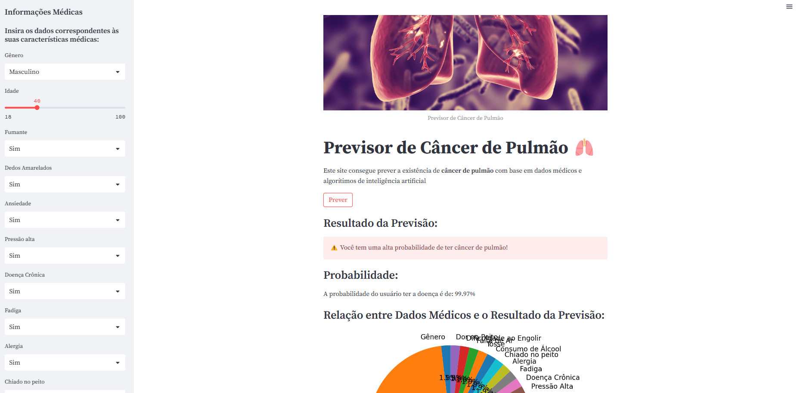

# Aplicativo de Previsão de Câncer de Pulmão


Este projeto consiste em um aplicativo que utiliza um modelo de machine learning para prever a probabilidade de câncer de pulmão com base em dados médicos fornecidos pelo usuário. O aplicativo foi desenvolvido utilizando a biblioteca Streamlit.

## Sumário do Código
### Parte 1: Treinamento do Modelo e Avaliação
Treinamento de Modelos de Machine Learning:

- Treinamento de modelos como Regressão Logística, Support Vector Machine (SVM) e Gaussian Naive Bayes.
- Avaliação do desempenho dos modelos utilizando métricas como precisão, recall e f1-score.
- Visualização Comparativa de Modelos:

- Criação de um gráfico de barras para comparar a acurácia dos modelos treinados.
- Persistência do Modelo:

- Salvamento do modelo de Regressão Logística utilizando a biblioteca Joblib.
### Parte 2: Aplicativo Streamlit para Previsão



- Carregamento do Modelo:

Utilização da biblioteca Joblib para carregar o modelo de Regressão Logística treinado.
- Interface Gráfica com Streamlit:

Criação de uma interface gráfica amigável utilizando Streamlit para interação com o usuário.
- Entrada de Dados:

Utilização de barras laterais interativas para coletar informações médicas do usuário, como gênero, idade, hábitos de fumo, e outros.
Previsão e Exibição de Resultados:

Após o usuário inserir seus dados, o modelo é utilizado para prever a probabilidade de câncer de pulmão.
Exibição do resultado da previsão, indicando se há uma alta ou baixa probabilidade de câncer de pulmão.
Apresentação da probabilidade específica em formato percentual.
- Visualização Gráfica:

Criação de um gráfico circular para ilustrar como os dados médicos inseridos se relacionam com o resultado da previsão.
- Persistência do Modelo:

Salvamento do modelo treinado em um arquivo utilizando Joblib.
## Execução do Código
Certifique-se de ter as bibliotecas Joblib, Streamlit, Pandas, NumPy e Matplotlib instaladas. Execute o código em um ambiente Python compatível.

### Parte 1:
```bash
pip install pandas matplotlib seaborn numpy scikit-learn joblib
python script_parte1.py
```

### Parte 2:
```bash
pip install joblib streamlit pandas numpy matplotlib
streamlit run script_parte2.py
```
#### Tecnologias Utilizadas
- Python
- Pandas
- Matplotlib
- Seaborn
- NumPy
- Scikit-learn
- Joblib
- Streamlit
## Contribuições
Contribuições são bem-vindas! Sinta-se à vontade para abrir issues ou enviar pull requests.
